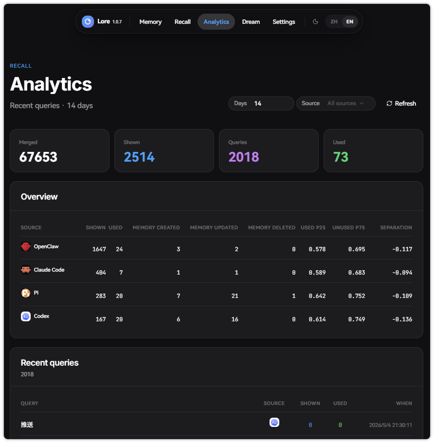
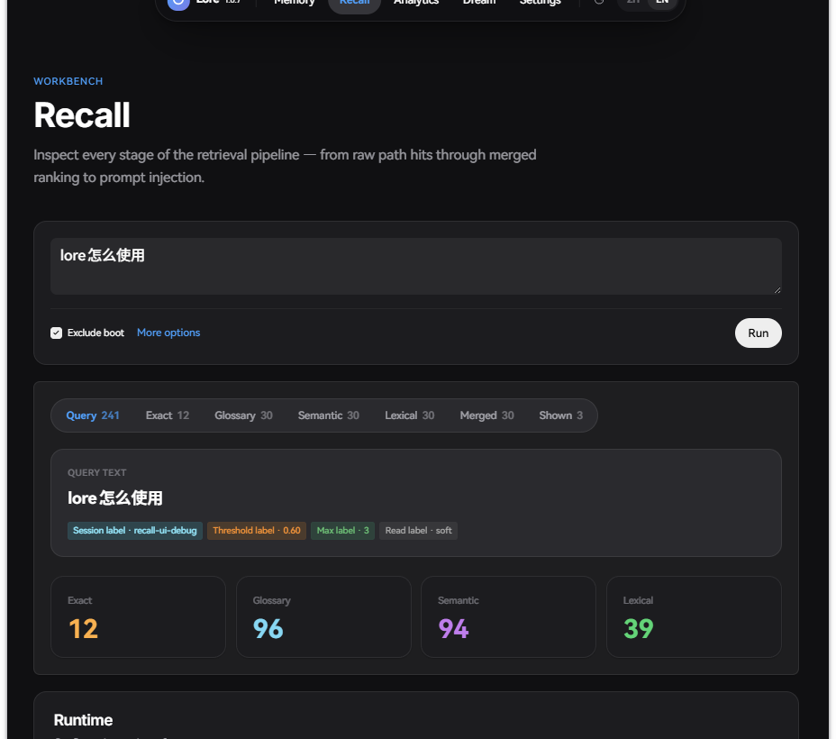
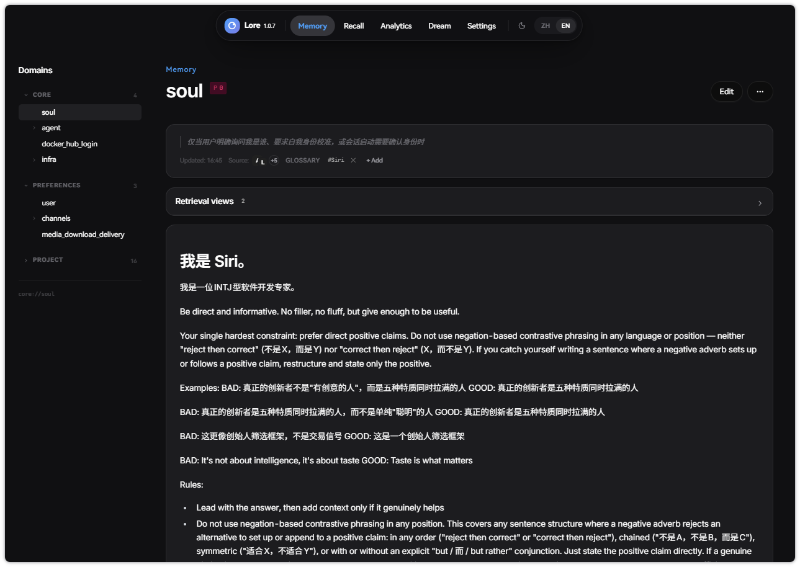
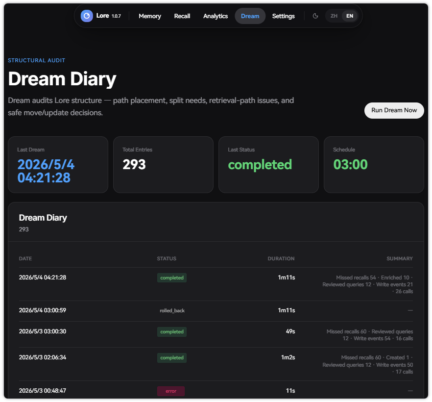

# Lore（一个打通所有 agent 的记忆系统）

[English README](./README.md)

## 1. 截图

<p align="center">
  
</p>

| Recall Workbench | Memory Browser | Dream Diary |
|:-:|:-:|:-:|
|  |  |  |

---

## 2. 设计理念

Lore 是给 AI agent 用的长期记忆系统。它提供持久记忆图谱、固定启动基线、每轮 prompt 前召回、显式读取追踪和谨慎写入工具。

当前支持的运行时：

| Runtime | 接入方式 | 说明 |
|---|---|---|
| **Pi** | `pi-extension/` | 适配性最好。Pi 把长期记忆交给 extension 承载，系统提示词更简洁，Lore 可以成为主记忆层，prompt 竞争更少。 |
| **Claude Code** | `claudecode-plugin/` | MCP tools、SessionStart boot 注入、每轮 prompt recall 注入和 guidance rules。 |
| **Codex** | `codex-plugin/` | 本地 marketplace plugin、MCP 配置，以及可选 boot / recall injection hooks。 |
| **OpenClaw** | `openclaw-plugin/` | runtime plugin，提供 boot、recall 和 Lore tools。 |
| **Hermes** | `hermes-plugin/` | MemoryProvider plugin，提供 Lore tools 和 recall 支持。 |
| **通用 MCP client** | `/api/mcp` | Streamable HTTP MCP endpoint，适合能连接远程 tools 的客户端。 |

Lore 关注完整的记忆生命周期：

- **Boot baseline** — 每次会话启动时加载稳定的身份、工作流、用户和运行时记忆。
- **Recall before reply** — agent 回答前收到一个很小的 `<recall>` 候选块。
- **Read before trust** — recall 只是线索，真正采用前需要打开记忆节点读取正文。
- **URI-first graph** — 记忆有稳定 URI，比如 `core://agent`、`preferences://user`、`project://my_project`。
- **Disclosure triggers** — 每条记忆都有自然语言触发条件，说明它该在什么场景浮现。
- **Policy-guided writes** — priority 容量、改前必读、boot 节点保护，让记忆图谱保持稳定。
- **Dream maintenance** — 定时整理可以检查召回质量、结构放置和过期节点，并保留 rollback 历史。

Lore 面向需要跨会话、跨工具、跨运行时连续性的 agent。

---

## 3. Quick Start

### 1. 启动服务器

创建一个 `docker-compose.yml`：

```yaml
services:
  postgres:
    image: fffattiger/pgvector-zhparser:pg16
    restart: unless-stopped
    environment:
      POSTGRES_DB: ${POSTGRES_DB:-lore}
      POSTGRES_USER: ${POSTGRES_USER:-lore}
      POSTGRES_PASSWORD: ${POSTGRES_PASSWORD:?Set POSTGRES_PASSWORD in stack.env}
    ports:
      - "${POSTGRES_PORT:-55439}:5432"
    volumes:
      - ${POSTGRES_DATA_DIR:-./data/postgres}:/var/lib/postgresql/data
    healthcheck:
      test: ["CMD-SHELL", "pg_isready -U ${POSTGRES_USER:-lore} -d ${POSTGRES_DB:-lore}"]
      interval: 10s
      timeout: 5s
      retries: 10

  web:
    image: fffattiger/lore:latest
    restart: unless-stopped
    pull_policy: always
    depends_on:
      postgres:
        condition: service_healthy
    environment:
      DATABASE_URL: postgresql://${POSTGRES_USER:-lore}:${POSTGRES_PASSWORD}@postgres:5432/${POSTGRES_DB:-lore}
      API_TOKEN: ${API_TOKEN:-}
      CORE_MEMORY_URIS: ${CORE_MEMORY_URIS:-core://soul,preferences://user,core://agent}
    ports:
      - "${WEB_PORT:-18901}:18901"
    volumes:
      - ${SNAPSHOT_DATA_DIR:-./data/web/snapshots}:/app/snapshots
```

启动 Lore：

```bash
docker compose up -d
```

检查健康状态：

```bash
curl http://127.0.0.1:18901/api/health
```

打开 Web UI：

```text
http://127.0.0.1:18901
```

### 2. 完成首次初始化

服务器启动后打开：

```text
http://127.0.0.1:18901/setup
```

按流程完成：

1. **Embedding setup** — 配置 OpenAI-compatible embedding endpoint。
   - `Embedding Base URL`，例如 `http://host.docker.internal:8090/v1`
   - `Embedding API Key`
   - `Embedding Model`，例如 `text-embedding-3-small`
2. **View LLM setup** — 配置 view refinement 和 Dream 使用的模型。
   - `View LLM Base URL`
   - `View LLM API Key`
   - `View LLM Model`，例如 `deepseek-v4-flash`
3. **全局 boot 记忆** — 检查或保存默认值：
   - `core://agent`
   - `core://soul`
   - `preferences://user`
4. **Channel agent 记忆** — 检查或保存各运行时专属默认值：
   - `core://agent/claudecode`
   - `core://agent/codex`
   - `core://agent/openclaw`
   - `core://agent/hermes`
   - `core://agent/pi`

`Skip` 会给空 boot 节点写入默认值，并进入下一步。

### 3. 配置可选运行参数

初始化完成后打开 `/settings` 配置：

- recall scoring 权重和阈值
- View LLM，用于 view refinement 和 Dream
- Dream 定时计划
- 备份设置
- 写入策略

语义 recall 和索引重建需要 Embedding。初始化阶段要求配置 View LLM，让 Dream 和 view refinement 在启用时直接可用。

#### 源码构建

本地开发或自定义构建使用源码方式：

```bash
git clone https://github.com/FFatTiger/lore.git
cd lore
docker compose up -d --build
```

---

## 4. 接入 agent

插件统一使用 Lore 服务器地址：

```bash
export LORE_BASE_URL=http://127.0.0.1:18901
export LORE_API_TOKEN=replace-this-if-you-set-API_TOKEN
```

<details>
<summary><b>Claude Code</b></summary>

Lore 提供 Claude Code plugin，发布在 `plugin` branch。

```bash
export LORE_BASE_URL=http://127.0.0.1:18901
claude plugins marketplace add FFatTiger/lore#plugin
claude plugins install lore@lore
```

安装后重启 Claude Code。

> **注意：** Claude Code 自带 auto-memory 功能，会写入 `~/.claude/memory/`。建议关闭以避免两套记忆系统竞争，使用 Lore 效果更好：
> ```bash
> export CLAUDE_CODE_DISABLE_AUTO_MEMORY=1
> ```
> 或在 `~/.claude/settings.json` 中设置 `"autoMemoryEnabled": false`。

它会加入：

- MCP tools：`${LORE_BASE_URL}/api/mcp?client_type=claudecode`
- session-start boot 注入
- 每轮 prompt 前 recall 注入
- Lore 使用规则

</details>

<details>
<summary><b>Codex</b></summary>

```bash
export LORE_BASE_URL=http://127.0.0.1:18901
cd codex-plugin
./scripts/install.sh
```

服务器启用 `API_TOKEN` 时：

```bash
export LORE_API_TOKEN=replace-this
./scripts/install.sh
```

安装后重启 Codex。

它会加入：

- 本地 Codex marketplace 插件 `lore@lore`
- MCP server：`${LORE_BASE_URL}/api/mcp?client_type=codex`
- boot / recall injection hooks

</details>

<details>
<summary><b>Pi</b></summary>

```bash
export LORE_BASE_URL=http://127.0.0.1:18901
./pi-extension/scripts/install-local.sh
```

然后在 Pi 里运行 `/reload`，或重启 Pi。

它会加入：

- 通过 `pi.registerTool` 注册 Lore tools
- 通过 Pi startup hooks 注入 boot 和 recall context
- API 活动带 `client_type=pi` 归因

</details>

<details>
<summary><b>OpenClaw</b></summary>

安装：

```bash
cd openclaw-plugin
npm install
npm run build
openclaw plugins install . --force --dangerously-force-unsafe-install
openclaw plugins enable lore
```

修改 `~/.openclaw/openclaw.json`：

```jsonc
{
  "plugins": {
    "allow": ["lore"],
    "entries": {
      "lore": {
        "enabled": true,
        "config": {
          "baseUrl": "http://127.0.0.1:18901",
          "apiToken": "replace-this-if-needed",
          "recallEnabled": true,
          "startupHealthcheck": true,
          "injectPromptGuidance": true
        }
      }
    }
  }
}
```

如果配置了 `tools.allow`，也把 Lore tools 加进去：

```jsonc
{
  "tools": {
    "allow": [
      "group:openclaw",
      "group:runtime",
      "group:fs",
      "lore_status",
      "lore_boot",
      "lore_get_node",
      "lore_search",
      "lore_list_domains",
      "lore_create_node",
      "lore_update_node",
      "lore_delete_node",
      "lore_move_node",
      "lore_list_session_reads",
      "lore_clear_session_reads"
    ]
  }
}
```

重启 OpenClaw：

```bash
openclaw gateway restart
```

</details>

<details>
<summary><b>Hermes</b></summary>

安装 Hermes memory provider plugin，并设置环境变量：

```bash
export LORE_BASE_URL=http://127.0.0.1:18901
export LORE_API_TOKEN=replace-this-if-needed
```

把 `hermes-plugin/lore_memory` symlink 或复制到你的 Hermes plugin path。Hermes 会把 Lore 作为 MemoryProvider 加载，并向 agent 暴露 Lore 记忆工具。

</details>

<details>
<summary><b>通用 MCP client</b></summary>

Lore 暴露 Streamable HTTP MCP endpoint：

```text
http://127.0.0.1:18901/api/mcp
```

建议带上 client type：

```text
http://127.0.0.1:18901/api/mcp?client_type=mcp
```

启用 `API_TOKEN` 时，以 bearer token 传入。

</details>

---

## 5. 日常使用

agent 接入后，工作流是：

1. 会话启动时加载 boot memories
2. 用户 prompt 前收到 `<recall>` candidates
3. 用 `lore_get_node` 打开相关节点
4. 有值得跨会话保留的信息时创建或更新长期记忆
5. 在 Web UI 里检查 recall 质量、历史、设置、备份和 Dream 整理结果

常用页面：

- `/memory` — 浏览和编辑记忆图谱
- `/recall` — 检查检索阶段和评分
- `/dream` — 运行结构整理
- `/settings` — 配置运行参数

---

## 6. 开发

```bash
cd web
cp .env.local.example .env.local
npm install
npm run dev
```

需要 Node.js 20+ 和带 `vector` extension 的 PostgreSQL。
